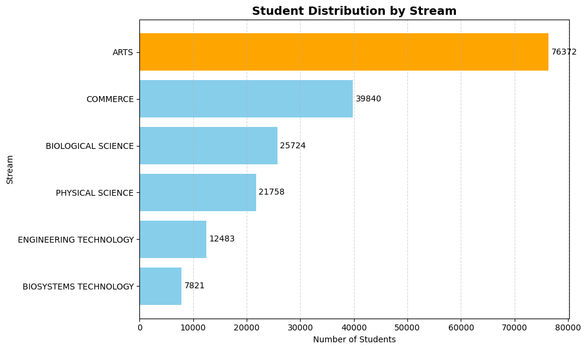

# 🎓 SriLanka-Student-Performance-Analysis-GCE-AL-Exam_2020

## 🚀 Project Type
Exploratory Data Analysis (EDA)

## 📌 Overview
This project analyzes student dataset to understand patterns in:
- Stream distribution
- Student demographics
- Performance trends

## 🛠 Tools Used
- Python
- Pandas
- Matplotlib

## 📊 Key Findings
- Arts stream has the highest number of students
- Biosystems Technology has the lowest participation

## 📊 Dataset Info
- Total records: 149,311 students
- Data includes stream, gender, and academic performance
  
## 📊 Stream Distribution

## 🔍 Key Questions Answered
- Which stream has the most students?
- How are students distributed across streams?
- Are there data quality issues?
- What cleaning steps were required?
  
## 🧹 Data Cleaning
- Removed invalid date values (e.g., "Invalid day error")
- Converted birth day, month, and year into datetime format
- Checked for unusual values in columns
- Validated dataset consistency before analysis  

## 📌 Conclusion
The analysis highlights clear differences in student distribution across streams.  
Arts dominates enrollment, while technical streams have lower participation.  
Data cleaning played a crucial role in ensuring accurate insights.

## 📁 Project Files
- student-performance-analysis.ipynb

## 🚀 Author
Raki
